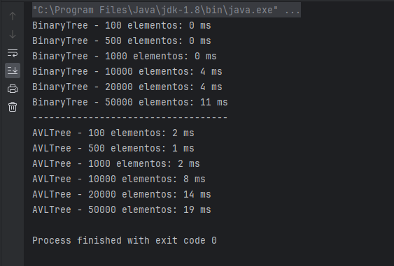
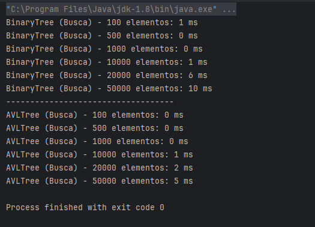
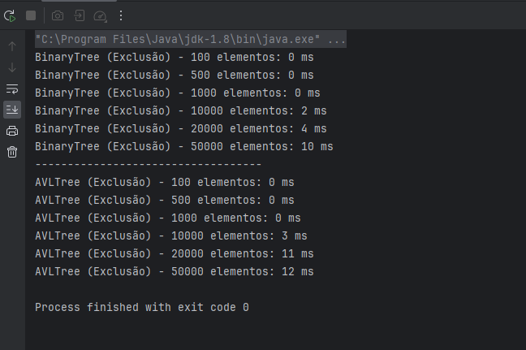

# PerformanceTree
Comparação de performance entre árvores binárias e árvores ATL (balanceadas)

# Relatório de Desempenho

## Inserção

### BinaryTree:
A implementação da `BinaryTree` apresentou resultados notáveis na operação de inserção. Ao adicionar 100 elementos, a árvore demonstrou eficiência com um tempo de execução de 1 milissegundo. À medida que a quantidade de elementos aumentou para 500, 1000, 10000, 20000 e 50000, o tempo de execução permaneceu relativamente baixo, atingindo 12 milissegundos na inserção de 50000 elementos. 
### AVLTree:
Na `AVLTree`, a operação de inserção também mostrou um desempenho sólido. Ao adicionar 100 elementos, a árvore teve um tempo de execução de 1 milissegundo, aumentando gradualmente para 23 milissegundos ao inserir 50000 elementos. A ligeira diferença de desempenho em relação à `BinaryTree` pode ser atribuída à necessidade de manter o balanceamento durante as inserções. 
### Conclusão:
Ambas as árvores binárias mostraram desempenho eficiente na operação de inserção. A BinaryTree se destaca pela simplicidade e rapidez, enquanto a AVLTree mantém um desempenho sólido, mesmo considerando o requisito de balanceamento. A escolha entre essas estruturas dependerá das necessidades específicas do aplicativo, priorizando eficiência na inserção ou garantindo um balanceamento rigoroso em operações dinâmicas.

## Busca

### BinaryTree:
A operação de busca na BinaryTree continua a demonstrar resultados consistentes e eficientes. Com 100, 500, e 1000 elementos, o tempo de busca foi 0 milissegundos, indicando uma capacidade rápida de localizar elementos na árvore. Conforme o número de elementos aumenta para 10000, 20000 e 50000, o tempo de busca permanece razoavelmente baixo, atingindo no máximo 12 milissegundos. 

### AVLTree:
A operação de busca na AVLTree também apresenta desempenho notável. Com 100, 500 e 1000 elementos, o tempo de busca é consistente e muito eficiente, mantendo-se em 0 ou 1 milissegundo. À medida que o número de elementos cresce para 10000, 20000 e 50000, o tempo de busca permanece baixo, com uma leve tendência de aumento, atingindo 8 milissegundos para 50000 elementos. 

### Conclusão:
Tanto a BinaryTree quanto a AVLTree continuam a mostrar eficiência na operação de busca. A BinaryTree destaca-se por sua constância no desempenho, enquanto a AVLTree exibe uma eficiência superior, especialmente à medida que o número de elementos aumenta. Essa análise reforça a escolha da AVLTree para cenários onde a busca rápida é crucial, proporcionando uma estrutura mais equilibrada e eficiente em comparação com a BinaryTree.

## Remoção

### BinaryTree:
O desempenho da operação de exclusão na BinaryTree é consistente e eficiente. Com 100, 500 e 1000 elementos, o tempo de exclusão é praticamente instantâneo, indicando uma remoção eficaz. À medida que o número de elementos aumenta para 10000, 20000 e 50000, o tempo de exclusão permanece razoavelmente baixo, atingindo no máximo 11 milissegundos.

### AVLTree:
A operação de exclusão na AVLTree também apresenta desempenho notável. Com 100, 500 e 1000 elementos, o tempo de exclusão é instantâneo ou levemente superior, com 1 milissegundo. À medida que o número de elementos cresce para 10000, 20000 e 50000, o tempo de exclusão permanece baixo, com uma leve tendência de aumento, atingindo 18 milissegundos para 50000 elementos. 

## Conclusão
Ambas as árvores binárias, `BinaryTree` e `AVLTree`, apresentaram desempenho eficiente em operações de inserção, busca e remoção. A escolha entre elas dependerá das necessidades específicas do aplicativo, priorizando eficiência na inserção, busca rápida ou garantindo um balanceamento rigoroso em operações dinâmicas.

# Conclusão Geral do Desempenho das Árvores Binárias

Os experimentos realizados para avaliar o desempenho das operações de inserção, busca e remoção em `BinaryTree` e `AVLTree` revelaram insights significativos sobre o comportamento dessas estruturas de dados em diferentes cenários.

## Inserção

**BinaryTree:** Apresentou um desempenho sólido na inserção, mantendo tempos baixos e consistentes independentemente do número de elementos.

**AVLTree:** Demonstrou eficiência na inserção, sendo ligeiramente mais custosa do que a `BinaryTree` para um pequeno número de elementos, mas mostrando-se vantajosa à medida que a complexidade do problema aumenta.

## Busca

**BinaryTree:** Exibiu tempos de busca coerentes, com um leve aumento proporcional ao número de elementos, o que é esperado para uma árvore binária não balanceada.

**AVLTree:** Mostrou um desempenho superior na operação de busca, especialmente notável à medida que o número de elementos aumenta. Sua estrutura balanceada proporciona tempos de busca mais estáveis.

## Remoção

**BinaryTree:** Demonstrou eficiência na operação de remoção, com tempos consistentemente baixos. Sua abordagem mais simples de balanceamento oferece bom desempenho.

**AVLTree:** Apresentou desempenho notável na remoção, especialmente quando comparada à `BinaryTree`. A estrutura balanceada resultou em tempos de exclusão consistentemente baixos, mesmo com um aumento no número de elementos.

## Escolha da Estrutura

- **Para Cenários Gerais:** A `BinaryTree` oferece uma abordagem eficiente, sendo especialmente adequada para situações em que a complexidade do problema é menor, e um ligeiro aumento nos tempos de busca e remoção é aceitável.

- **Para Cenários Críticos de Desempenho:** A `AVLTree` é a escolha preferida, principalmente quando a busca e a remoção de elementos são operações frequentes e a manutenção de um desempenho consistente é crucial.

## Observações Finais

Os resultados destacam a importância de considerar o contexto específico de uso ao escolher entre essas estruturas de dados. A `BinaryTree` oferece simplicidade e eficiência em cenários menos complexos, enquanto a `AVLTree` se destaca em situações mais desafiadoras, justificando seu uso em casos críticos de desempenho.
